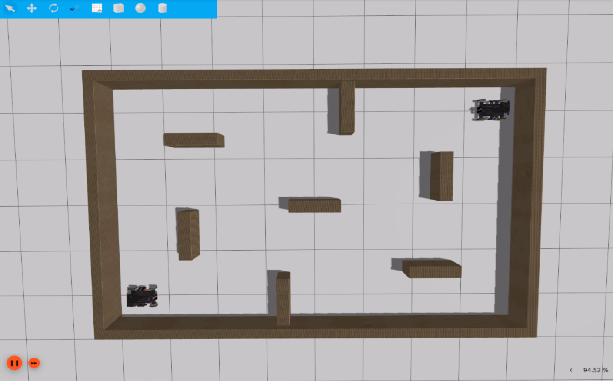

# rmua19_ignition_simulator

### 1. 简介

rmua19_ignition_simulator是基于Ignition Gazebo的仿真环境，为RoboMaster University AI Challenge 2019中的机器人算法开发提供仿真环境，方便测试AI算法，加快开发效率。


目前rmua19_ignition_simulator还不完善，仅提供以下功能：

在rmua19标准机器人（rmua19_standard_robot）上增加相关传感器，构建不同机器人模型:
  * rmua19_standard_robot_a：搭载云台相机industrial_camera和搭载激光雷达rplidar_a2，其中相机放置有在yaw轴。
  * rmua19_standard_robot_b：搭载云台相机industrial_camera和搭载激光雷达rplidar_a2，其中相机放置有在pitch轴。

构建RoboMaster University AI Challenge 2019简易场地(models/rmua19_battlefield):
  * 只有围墙

> RoboMaster University AI Challenge 2019标准机器人机器人模型(rmua19_standard_robot)位于[rmoss_ign_resources](https://github.com/robomaster-oss/rmoss_ign_resources)
>
> 注意：[Ignition Gazebo](https://github.com/ignitionrobotics/ign-gazebo)目前依然处于快速开发期，仿真功能不完善，且可能存在Bug。

### 2. 基本使用

**环境配置**

* ROS2版本要求: `Galatic` (目前处于开发期，基于ROS2最新版本)
* Ignition仿真器版本要求: ` Edifice` (目前处于开发期，基于Ignition最新版本)

```bash
# install ros-ign package
sudo apt-get install ros-galactic-ros-ign
# install xmacro (xml macro tool for sdf)
pip install xmacro
# cd src directory of ros2 workspace 
git clone https://github.com/robomaster-oss/rmoss_interfaces
git clone https://github.com/robomaster-oss/rmoss_ign
git clone https://github.com/robomaster-oss/rmoss_ign_resources
git clone https://github.com/robomaster-oss/rmua19_ignition_simulator
# cd ros2 workspace
colcon build
```

**启动仿真环境**

```bash
# ros2 launch rmua19_ignition_simulator standard_robot_a_test.launch.py 
ros2 launch rmua19_ignition_simulator standard_robot_b_test.launch.py 
```

* 注意：需要点击ignition界面上的橙红色的`启动`按钮

**控制机器人移动**

```bash
ros2 run rmoss_ign_base test_chassis_cmd.py --ros-args -r __ns:=/standard_robot_red1/robot_base -p v:=0.3 -p w:=0.3
#根据提示进行输入，支持平移与自旋
```

* 底盘采用mecanum插件控制

**控制机器人云台**

```bash
ros2 run rmoss_ign_base test_gimbal_cmd.py --ros-args -r __ns:=/standard_robot_red1/robot_base
#根据提示进行输入，支持绝对角度控制
```

* 云台采用位置PID控制

**机器人射击**

```bash
ros2 run rmoss_ign_base test_shoot_cmd.py --ros-args -r __ns:=/standard_robot_red1/robot_base
#根据提示进行输入
```

* 射击功能基于`rmoss_ign`中的插件`ProjectileShooter`，
* **注意：目前存在未解决BUG (某些情况下会使得物理引擎错误，造成Ignition Gazebo崩溃)**

### 3. 简易竞赛模式1v1

* 目前测试中，射击功能存在已知BUG，以及可能存在其他未知BUG，请谨慎使用。

**运行Ignition Gazebo仿真器**

```bash
ros2 launch rmua19_ignition_simulator simple_competition_1v1.launch.py 
```



**运行裁判系统**

```bash
ros2 run rmua19_ignition_simulator simple_competition_1v1_referee.py 
```

* 弹丸伤害为10，每个机器人HP为500，直到HP为0时，裁判系统输出胜利者，程序退出。（可重新运行开始）
* 通过解析并处理攻击信息`/referee_system/attack_info` （包括射击者信息以及击中目标信息）实现裁判功能。

**控制机器人-ROS2接口**

例如，对于standard_robot_red1，有如下ROS2 topic接口使用，可用于机器人控制和感知。(对于standard_robot_blue1同理)

```bash
/standard_robot_red1/robot_base/chassis_cmd
/standard_robot_red1/robot_base/gimbal_state
/standard_robot_red1/robot_base/odom
/standard_robot_red1/robot_base/shoot_cmd
/standard_robot_red1/front_camera/image
/standard_robot_red1/rplidar_a2/scan
```

### 3. 网页端使用

- 切换到\rmua19_ignition_simulator\scripts\player_web目录下
- pip install -r requirement.txt
- 运行python main.py
- 浏览器中输入127.0.0.1:5000即可。


### 4. 维护者及开源许可证

Maintainer: Zhenpeng Ge, zhenpeng.ge@qq.com

rmua19_ignition_simulator is provided under Apache License 2.0.

