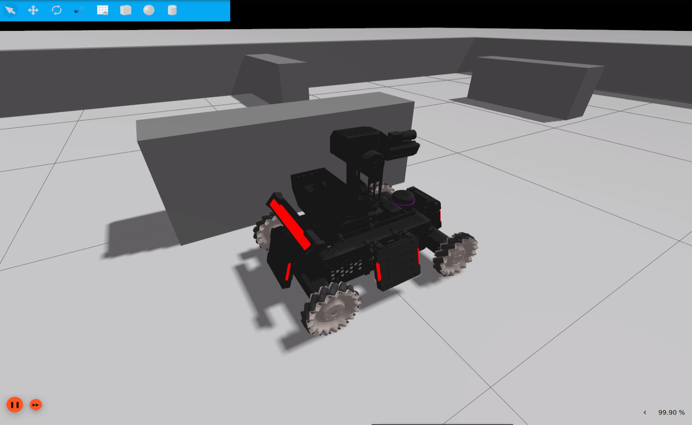

# rmua19_ignition_simulator

### 1.简介

rmua19_ignition_simulator是基于Ignition Gazebo的仿真环境，为RoboMaster University AI Challenge 2019中的机器人算法开发提供仿真环境，加快开发效率。目前rmua19_ignition_simulator还不完善，仅提供以下功能：

* RoboMaster University AI Challenge 2019简易场地：只有围墙
* RoboMaster University AI Challenge 2019 标准机器人模型
  * 使用[xacro4sdf](https://github.com/gezp/xacro4sdf)进行SDF建模，模型图纸来自[RoboRTS](https://github.com/RoboMaster/RoboRTS) 中的 [RoboMaster AI机器人机械图纸](https://robomaster.github.io/RoboRTS-Tutorial/#/resources?id=robomaster-ai机器人机械图纸)
  * 支持麦克拉姆轮地盘，使用[rmoss_ign](https://github.com/robomaster-oss/rmoss_ign)中的[麦克拉姆轮插件](https://github.com/robomaster-oss/rmoss_ign/tree/main/rmoss_ign_plugins/src/mecanum_drive)，支持里程计(模拟里程计，无nosie)
  * 支持云台（pitch,yaw）角度控制，使用Ignition官方插件`JointPositionController`
  * 搭载云台相机，激光雷达等传感器，可进行开发slam等应用开发。
  * 具有装甲板灯条发光效果，可测试自瞄等识别算法。
* ros2接口：robot_base模块
  * 可使用通用的ros2 msg控制机器人移动

> 不支持发射子弹。

### 2.使用说明

**环境配置**

ROS2和Ignition版本

* ROS2：foxy
* Ignition：Dome

```bash
# install ros-ign package
sudo apt-get install ros-foxy-ros-ign
# cd src directory of ros2 workspace 
git clone https://github.com/robomaster-oss/rmoss_interfaces
git clone https://github.com/robomaster-oss/rmoss_ign
git clone https://github.com/robomaster-oss/rmoss_ign_resources
git clone https://github.com/robomaster-oss/rmua19_ignition_simulator
# cd ros2 workspace
colcon build
```

**启动仿真环境**

```bash
ros2 launch rmua19_ignition_simulator standard_robot2_test.launch.py 
```

* 注意：需要点击ignition界面上的橙红色的`启动`按钮



**控制机器人移动**

```bash
ros2 run rmua19_ignition_simulator test_control_chassis.py --ros-args -r __ns:=/standard_robot_red1 -p v:=0.3 -p w:=0.3
```

根据以下提示输入

```bash
This node takes keypresses from the keyboard and publishes them
as ChassisCmd messages.
---------------------------
Moving around:
        w    
   a    s    d
turn : '[' for left  ']' for right
stop : space key
---------------------------
CTRL-C to quit
```

* 底盘采用mecanum插件控制

**控制机器人云台**

```bash
ros2 run rmua19_ignition_simulator test_control_gimbal.py --ros-args -r __ns:=/standard_robot_red1
```

根据以下提示输入

```bash
This node takes keypresses from the keyboard and publishes them
as GimbalCmd messages.
---------------------------
contorl around:
        w    
   a    s    d
change  interval : '[' to decrease,  ']' to increase
---------------------------
CTRL-C to quit
```

* 云台采用位置PID控制

### 3.维护者及开源许可证

* maintainer: Zhenpeng Ge, zhenpeng.ge@qq.com

* rmua19_ignition_simulator is provided under MIT.

